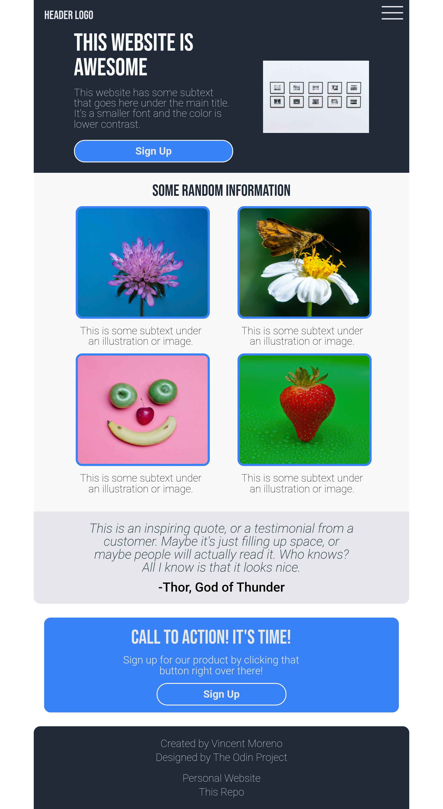
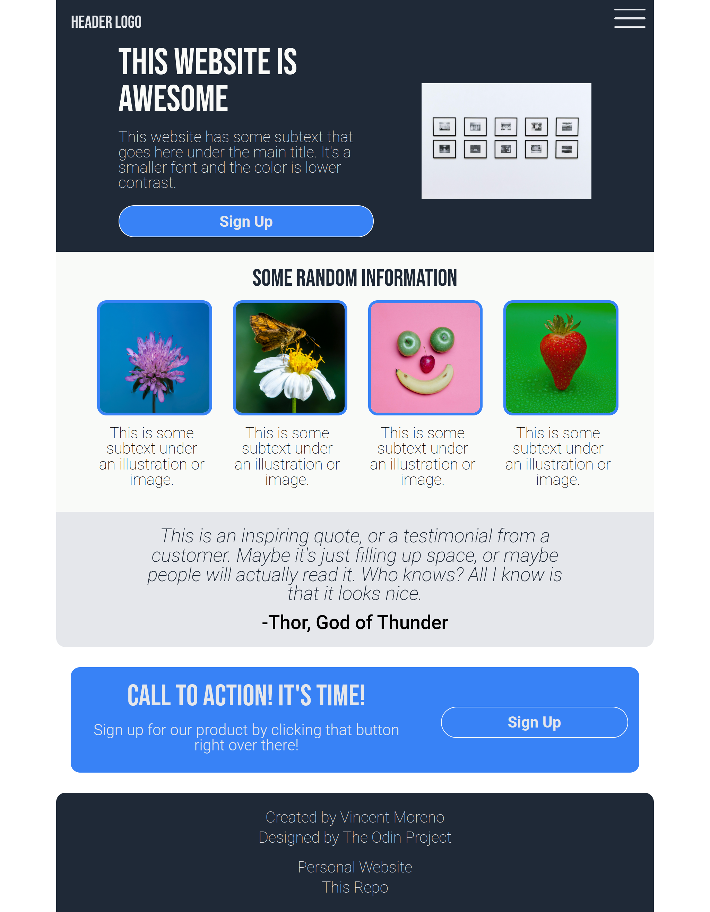

# Landing Page

This project is a responsive landing page built as part of The Odin Project’s Foundations curriculum.  
In addition to the required layout and styling goals, I added extra features such as a mobile-first design, responsive navigation, and internal reference links.  

## Features
- Semantic HTML structure and CSS Flexbox layout (Odin requirements)  
- Mobile-first design for mobile, tablet, and desktop devices (extra)  
- Responsive navigation with drop-down and hidden menus (extra)  
- Internal reference links for smooth page navigation (extra)  

## Tech Stack
- HTML5  
- CSS3  

## Preview

  
  
  

## Future Improvements

- Smooth animations and transitions  
- More interactivity with JavaScript  

## Acknowledgements
- Built as part of [The Odin Project](https://www.theodinproject.com/lessons/foundations-landing-page)  
- Photos from [Unsplash](https://unsplash.com/)  
- Fonts from [Google Fonts](https://fonts.google.com/) 
